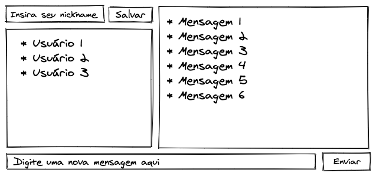

# WebChat Project

Um _chat_ online e ao utilizar essa aplicação, um usuário deverá ser capaz de:
 - Usar um front-end para enviar mensagens a clientes conectados;
 - Visualizar o histórico de mensagens da conversa;
 - Visualizar os usuários online no momento;
 - Alterar o nome de usuário no chat em tempo real;



# Sumário

- [Habilidades](#habilidades)
- [Desenvolvimento](#desenvolvimento)
- [Instruções do projeto](#instruções-do-projeto)
- [Execução de testes unitários](#execução-de-testes-unitários)
- [Linter](#linter)
- [Observações importantes](#-observações-importantes)

# Habilidades

- Desenvolver um server socket usando o socket.io;

- Emitir eventos personalizados usando o socket.io;

- Usar o pacote `socket.io` do Node.js para criar aplicações que trafeguem mensagens através de sockets.


# Desenvolvimento

Uma aplicação `Node.js` de _chat_, usando `socket.io` para emitir eventos e atualizar estado no servidor e cliente.

Através do cliente será possível enviar e receber mensagens, trocar seu nome, ver usuários online.

O `MVC` será usado para renderizar as mensagens do histórico e usuários online, com ambos vindo direto do servidor.


# Instruções do projeto:

1. Clone ou download o repositório

2. Mude para a branch de desenvolvimento
  * Va para a branch `dev`
    * `git checkout dev`
3. Instale as dependências e inicialize o projeto
  * Instale as dependências:
    * `npm install`
  * Inicialize o projeto:
    * `npm start`
  * Verifique que os testes estão executando:
    * `npm test`

# Execução de testes unitários

Para executar os testes localmente, você pode rodar o comando `npm test`.

Caso prefira testar um requisito por vez pode executar o teste da seguinte forma: `npm test tests/req1` (nesse caso testa apenas o requisito 1)

⚠️ Antes de executar os testes requisitos, principalmente do requisito 4, feche o seu navegador, pois ele pode afetar a execução dos testes.

# Linter

Para garantir a qualidade do código, usaremos o [ESLint](https://eslint.org/).

Este projeto já vem com as dependências relacionadas ao _linter_ configuradas nos arquivos `package.json` nos seguintes caminhos:

- `webchat/package.json`

Para poder rodar os `ESLint` em um projeto basta executar o comando `npm install` dentro do projeto e depois `npm run lint`. Se a análise do `ESLint` encontrar problemas no seu código, tais problemas serão mostrados no seu terminal. Se não houver problema no seu código, nada será impresso no seu terminal.

Você também pode instalar o plugin do `ESLint` no `VSCode`, bastar ir em extensions e baixar o [plugin `ESLint`](https://marketplace.visualstudio.com/items?itemName=dbaeumer.vscode-eslint).

# 👀 Observações importantes:

Há um arquivo no caminho: `webchat/models/connection.js` que fará a conexão com o Banco de Dados. Neste arquivo, na linha 9, há o seguinte comando:

`.connect(process.env.DB_URL, {`

e na linha 13:

`.then((conn) => conn.db(process.env.DB_NAME))`

**Você irá precisar configurar as variáveis globais do MongoDB.** Você pode usar esse [Conteúdo de variáveis de ambiente com NodeJS](https://blog.rocketseat.com.br/variaveis-ambiente-nodejs/) como referência.

** ⚠️ Neste projeto é "obrigatório* deixar o nome do database como `webchat` **

As variáveis de ambiente receberão os seguintes valores

```
DB_URL=mongodb://localhost:27017/webchat/    // conexão local com o seu MongoDB
DB_NAME=webchat                             // nome do database
```

### © Rafael Alstent